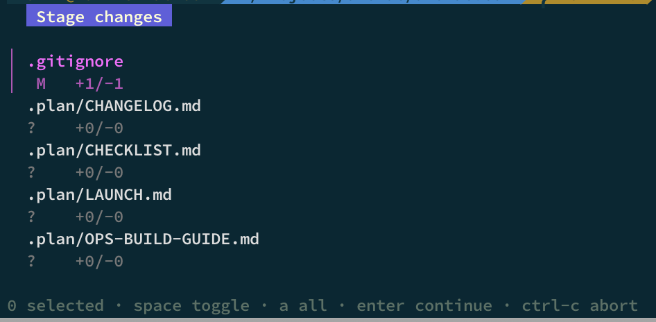
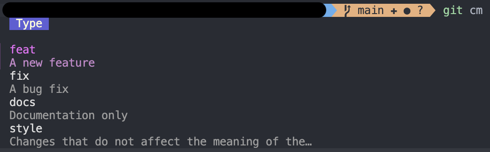
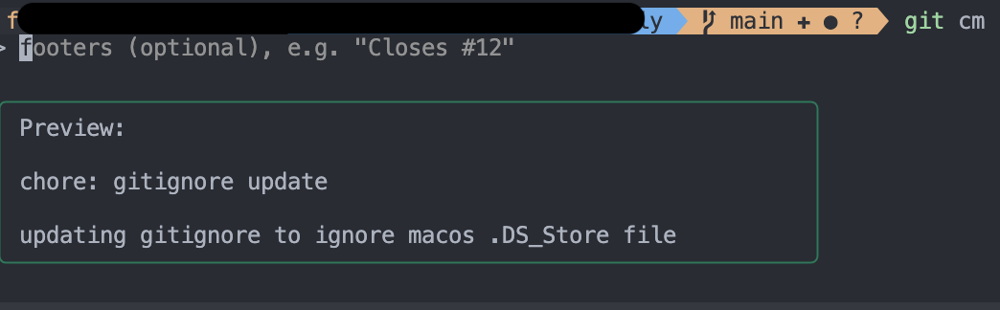
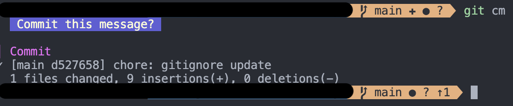
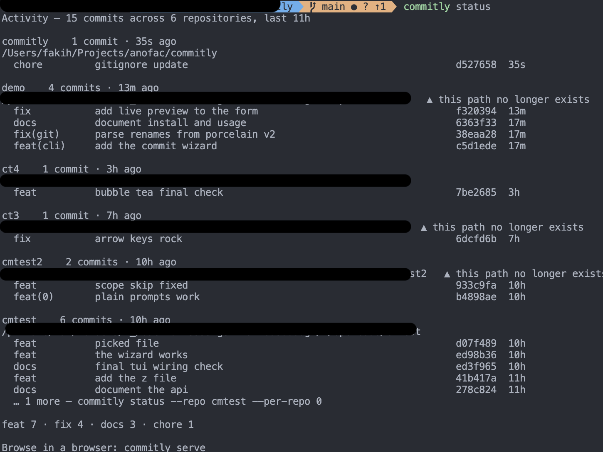
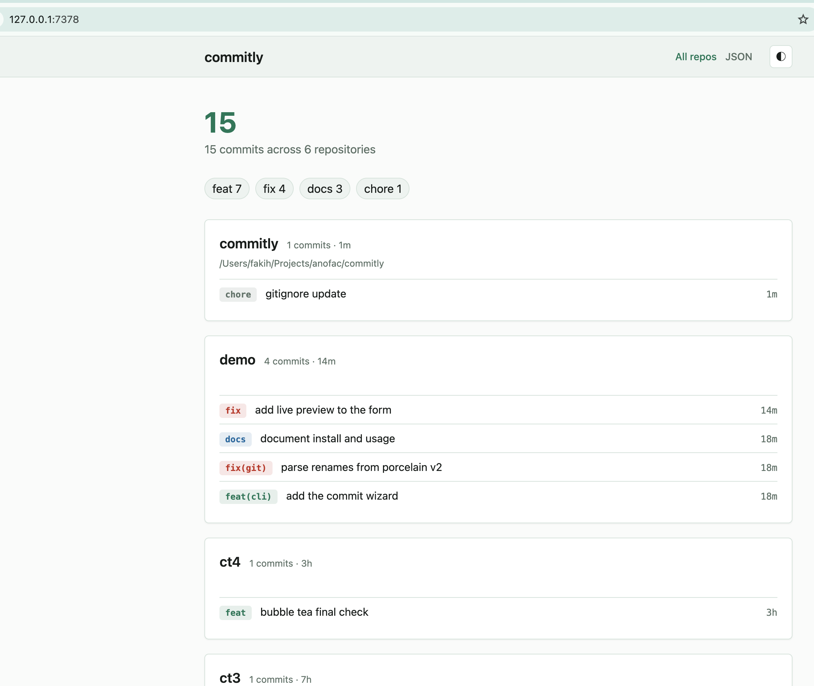
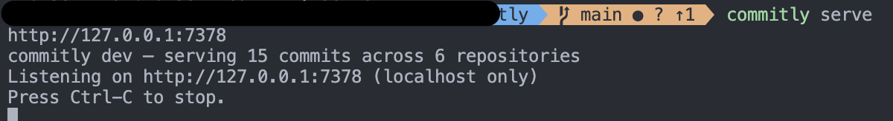

# commitly

Compose [Conventional Commits](https://www.conventionalcommits.org/) messages, interactively — in your terminal or as `git cm`.

One static binary, two names: `commitly` for the full command surface, and a `git-cm` symlink so `git cm` and `git cm -a` work with **zero configuration**. Everything is local and offline — nothing is ever uploaded.

## Screenshots

<div align="center">












</div>

## Install

`git cm` works immediately after any of these — no `init`, no alias, no config required.

| Channel | Command |
|---|---|
| **Homebrew** (macOS) | `brew tap fakihariefnoto/tap`<br>`brew install fakihariefnoto/tap/commitly` |
| **Scoop** (Windows) | `scoop bucket add fakihariefnoto https://github.com/fakihariefnoto/scoop-bucket`<br>`scoop install commitly` |
| **`.deb` / `.rpm`** (Linux) | `sudo dpkg -i commitly_*.deb` &nbsp;·&nbsp; `sudo rpm -i commitly_*.rpm` |
| **`go install`** | `go install github.com/fakihariefnoto/commitly/cmd/commitly@latest`<br>`commitly init` # adds the `git cm` alias (go install can't ship the symlink) |

## Quick start

```sh
git cm                    # compose a conventional commit, interactively
git cm -a                 # pick files to stage, then compose
commitly lint --range origin/main..HEAD
commitly changelog        # release notes since the last tag
commitly status           # what you've committed across every repo
commitly serve            # the same history as a local web page
```

## Commands

| Command | Purpose |
|---|---|
| `commitly commit` (`git cm`) | Compose and create a conventional commit |
| `commitly status` (`st`) | Your recent commits across every repo |
| `commitly serve` | Browse the same history in a browser (read-only, localhost) |
| `commitly lint` | Validate a message, a commit, or a range (exit `3` on failure — CI-friendly) |
| `commitly changelog` (`cl`) | Markdown release notes from conventional history |
| `commitly init` | Optional: git alias, `commit-msg` hook, completions, `.commitly.yaml` |
| `commitly config` | Inspect and edit configuration (`get` / `set` / `list` / `path`) |
| `commitly completion` · `man` · `version` | Generated artifacts and version info |

## Configuration

Config resolves from five sources, highest first: command flag → `COMMITLY_*` env → repo `.commitly.yaml` → user `~/.config/commitly/config.yaml` → built-in defaults. `commitly config get <key>` shows which source won.

A repo can pin its conventions in `.commitly.yaml` (types, scopes, subject rules, changelog headings). User-level settings (`history:`, `stats:`, `serve:`) are ignored in a repo config so a clone can never change how your personal activity is recorded.

## Privacy

Commitly records two local files in the OS state directory:

- `history.jsonl` — the newest 100 commits made *through* commitly (subjects, SHAs, repo paths). Written `0600`.
- `stats.jsonl` — ~2 years of daily counters. No message text, no SHAs, no paths.

Neither is ever uploaded. The `commit-msg` hook (optional, installed by `commitly init --hook`) can count conforming vs non-conforming commits for `status --stats` — disclosed in full before the first count, counters only, and disable-able while keeping validation.

## Updates

Update through whatever installed you: `brew upgrade commitly`, `scoop update commitly`, `apt`/`dnf`, or `go install ...@latest`. There is deliberately no `commitly self-update` — a self-updater would fight your package manager.

## License

MIT
