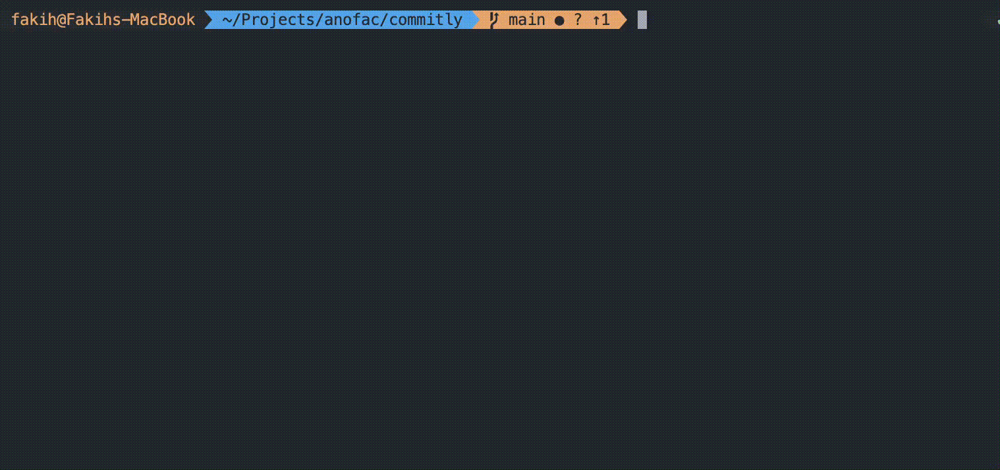

# commitly

> Compose [Conventional Commits](https://www.conventionalcommits.org/) messages without thinking about the format — in your terminal, or as `git cm`.

One static binary, two names: `commitly` for the full command surface, and a `git-cm` symlink so `git cm` just works with **zero configuration**. Everything runs locally and offline — nothing is ever uploaded.

## Why commitly?

Writing a good commit message is a habit, but remembering the format is friction. Most of us have typed a message, hit enter, and then watched CI reject it — or worse, shipped a `wip` commit into history that a changelog generator silently drops a year later.

Commitly removes that friction:

- **Stop memorizing the format.** Pick a type from a menu, tab through scope and subject, and a live preview shows the exact message as you compose it.
- **Consistent history, automatically.** The optional `commit-msg` hook validates every commit — even ones made with plain `git commit` — so the convention holds without anyone enforcing it.
- **Changelogs that work.** Conventional history turns into release notes with one command (`commitly changelog`), instead of diffing tags by hand.
- **See what you've actually done.** `commitly status` shows your recent commits across every repo; `commitly serve` renders the same view in your browser.
- **Zero cost to adopt.** No config file required, works offline, one static binary with no runtime to install. `git cm` works the moment it's on your `$PATH`.

If you've ever had a commit rejected for "missing space after the colon," this tool is for you.

## Screenshots

<div align="center">

**The whole flow**



<br>


</div>

## Install

`git cm` works immediately after any of these — no `init`, no alias, no config required.

**Homebrew** (macOS)

```sh
brew tap fakihariefnoto/tap
brew install fakihariefnoto/tap/commitly
```

**Scoop** (Windows)

```sh
scoop bucket add fakihariefnoto https://github.com/fakihariefnoto/scoop-bucket
scoop install commitly
```

**`.deb` / `.rpm`** (Linux)

```sh
# attach the .deb/.rpm from the release, then:
sudo dpkg -i commitly_*.deb     # or: sudo rpm -i commitly_*.rpm
```

**`go install`**

```sh
go install github.com/fakihariefnoto/commitly/cmd/commitly@latest
commitly init     # offers the `git cm` alias, since go install can't ship the symlink
```

## Quick start

```sh
git cm                    # compose a conventional commit, interactively
git cm -a                 # pick files to stage, then compose
commitly lint --range origin/main..HEAD
commitly changelog        # release notes since the last tag
commitly status           # what you've committed across every repo
commitly serve            # the same history as a local web page
```

## Commands

| Command | Purpose |
|---|---|
| `commitly commit` (`git cm`) | Compose and create a conventional commit |
| `commitly status` (`st`) | Your recent commits across every repo |
| `commitly serve` | Browse the same history in a browser (read-only, localhost) |
| `commitly lint` | Validate a message, a commit, or a range (exit `3` on failure — CI-friendly) |
| `commitly changelog` (`cl`) | Markdown release notes from conventional history |
| `commitly init` | Optional: git alias, `commit-msg` hook, completions, `.commitly.yaml` |
| `commitly config` | Inspect and edit configuration (`get` / `set` / `list` / `path`) |
| `commitly completion` · `man` · `version` | Generated artifacts and version info |

## How `git cm` works

One binary is installed under **two names**: `commitly` and a `git-cm` symlink. Git resolves `git cm` to any `git-cm` on `$PATH`, and commitly detects that it was invoked as `git-cm` and runs the commit flow — so `git cm` and `git cm -a` work with no alias and no setup.

The only exception is `go install`, which can't create a symlink — there, `commitly init` offers a `git config --global alias.cm` instead.

## Composing a commit

Run `git cm` (or `git cm -a` to pick files to stage first). A guided flow walks you through:

1. **Type** — pick from a menu (feat, fix, docs, …; `/` filters)
2. **Scope** — pick one, or add a new one for the repo (see [Scopes](#scopes))
3. **Subject** — type the description (max length enforced live)
4. **Breaking change?** — Yes/No; if yes, describe what breaks
5. **Body** and **Footers** (optional)
6. **Confirm** — a live preview shows the exact message; `Enter` commits, or pick "Edit again"

Every step can be escaped back with `Esc`. The whole flow is also scriptable with flags:

```sh
git cm --type fix --scope api --message "handle empty scope list"
```

On a non-terminal (a pipe, CI, a hook), missing values are an error rather than a hanging prompt — exit `2`. `COMMITLY_NO_TUI=1` forces the non-interactive path even on a terminal.

## Scopes

A scope labels which area of the code a change touches: `feat(api): …`, `fix(cli): …`. It's optional — `(none)` skips it — and the wizard only asks when the repo has scopes configured.

**Set the scope list from the CLI:**

```sh
commitly config set scope.values api,cli,web --local
```

This writes a `.commitly.yaml` in the repo (creating it if needed):

```yaml
scope:
  values:
    - api
    - cli
    - web
```

**Or edit the file directly:**

```yaml
scope:
  values:
    - { name: api,   description: The command-line surface }
    - { name: tui,   description: Terminal UI and rendering }
  mode: list        # list | free | auto | off
```

**Or add one mid-commit:** in the scope menu, pick **"+ Add new scope…"**, type the name, and it's used for the commit *and* written to the repo config for next time.

**`scope.mode` behavior:**

| mode | behavior |
|---|---|
| `list` | pick from `values` (arrows) |
| `free` | type any scope |
| `auto` | pre-filled from changed file paths (globs under `scope.auto`) |
| `off` | never asked |

With no values and mode `list`, the step is skipped entirely. A scope typed on a run where it isn't persisted still works for that commit.

## The `commit-msg` hook

`commitly init --hook` installs `.git/hooks/commit-msg`, which runs `commitly lint --file "$1" --hook` on **every** commit in the repo — including ones made with plain `git commit`. Non-conforming messages are rejected with the specific violation, so the convention holds without anyone enforcing it.

Two things the hook can do, separately:

- **Validate** — always on, unless the hook isn't installed.
- **Count** — when `stats.count_from_hook` is on (default), the hook records a counter for `commitly status --stats`: date, repo, conforming yes/no, type, yours-or-not. **No message text, no SHA, no paths.** This is disclosed in full before the hook is installed.

```sh
commitly config set stats.count_from_hook false    # keep validation, stop counting
```

If a `.git/hooks/commit-msg` already exists and wasn't written by commitly, `init` refuses to overwrite it (use `--force` to replace, or chain the check yourself). `core.hooksPath` is respected, so a shared `.githooks/` directory works.

## Configuration

Config resolves from five sources, highest first:

1. Command flag (`--type fix`)
2. Environment (`COMMITLY_SUBJECT__MAX_LENGTH=100`)
3. Repo config (`.commitly.yaml`, nearest walking up)
4. User config (`~/.config/commitly/config.yaml`)
5. Built-in defaults

`commitly config get <key>` prints a value **and which source won** — start there when a setting seems ignored.

```sh
commitly config set subject.max_length 100 --local    # this repo
commitly config set history.enabled false             # user-only key
commitly config list --sources                        # full config with provenance
commitly config path                                  # where everything lives
```

User-level settings (`history:`, `stats:`, `serve:`) are ignored in a repo config, so a clone can never change how your personal activity is recorded. Unknown keys warn rather than error — a repo pinned to a newer commitly stays usable on an older binary.

## Activity & statistics

`commitly status` and `commitly serve` render the same data from two local stores:

| Store | Holds | Written by | Retained |
|---|---|---|---|
| `history.jsonl` | subjects, SHAs, repo paths | commits made **through** commitly | newest 100 |
| `stats.jsonl` | daily counters only | commitly **and** the hook | ~2 years |

`status --stats` adds volume, type mix, rhythm and convention adherence for this week/month/all-time — each figure states the window it covers. `status --clear` and `status --stats --clear` wipe the stores separately.

## Drafts

If you abort a commit (`Ctrl-C`) or a hook rejects your message, what you typed is saved to `.git/COMMITLY_DRAFT`. The next `git cm` offers to restore it — it's never automatic, and the file lives inside `.git/` so it can't be committed or shown in `git status`.

- `Y` — restore, `n` — skip, `d` — discard
- `--no-draft` skips the check (for scripts)
- Empty junk drafts are discarded automatically
- Deleted on a successful commit

## Exit codes

Used by CI and scripts — treat them as stable API.

| Code | Meaning |
|---|---|
| `0` | Success (commit created, lint passed, changelog rendered) |
| `1` | The operation failed (not a repo, nothing staged, git rejected) |
| `2` | Bad invocation (unknown flag, missing required value on a non-TTY) |
| `3` | Validation failed — `lint` found an error-severity violation |
| `130` | Aborted with `Ctrl-C` (draft saved, index untouched) |

## Privacy

Commitly records two local files in the OS state directory:

- `history.jsonl` — the newest 100 commits made *through* commitly (subjects, SHAs, repo paths). Written `0600`.
- `stats.jsonl` — ~2 years of daily counters. No message text, no SHAs, no paths.

Neither is ever uploaded. The `commit-msg` hook (optional, installed by `commitly init --hook`) can count conforming vs non-conforming commits for `status --stats` — disclosed in full before the first count, counters only, and disable-able while keeping validation.

## Updates

Update through whatever installed you: `brew upgrade commitly`, `scoop update commitly`, `apt`/`dnf`, or `go install ...@latest`. There is deliberately no `commitly self-update` — a self-updater would fight your package manager.

## License

MIT
